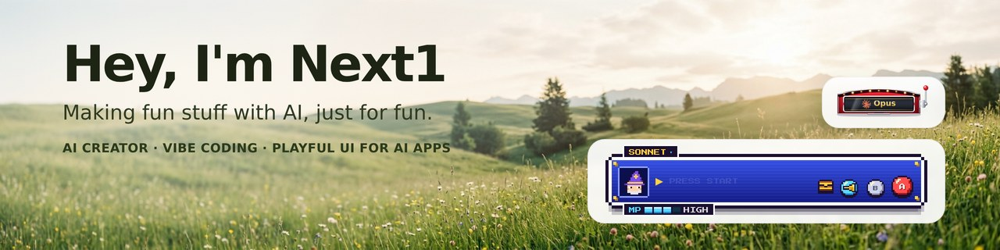
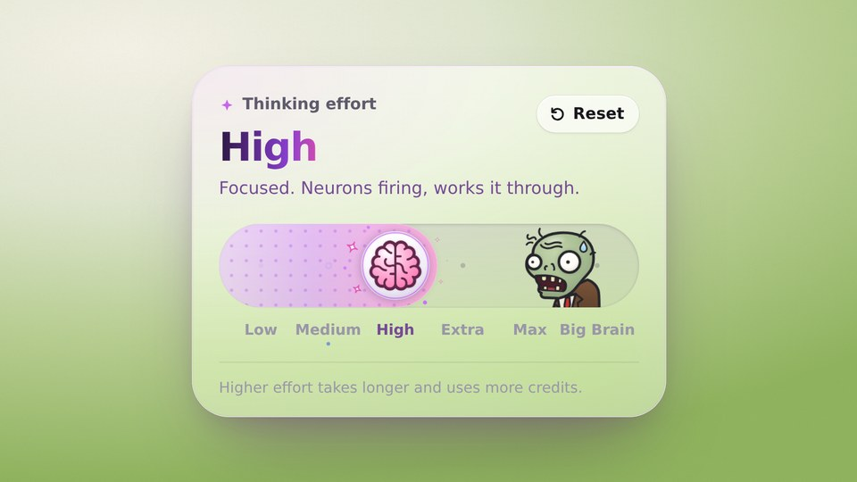
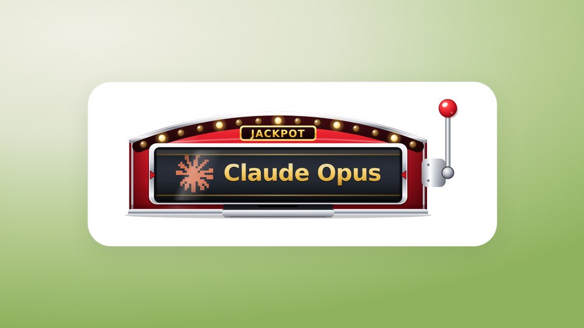
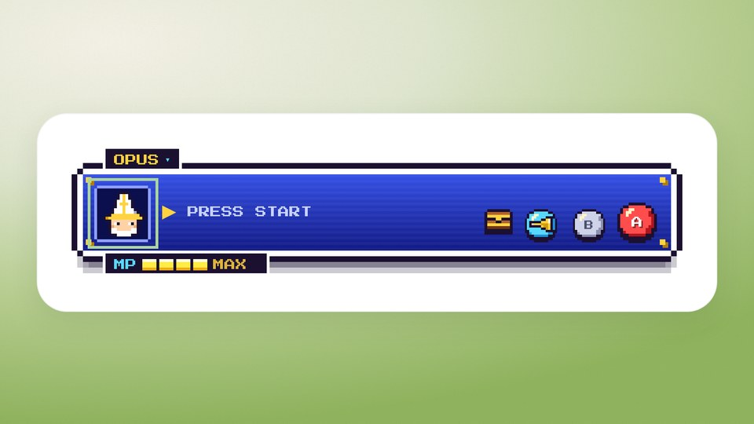

I make playful, illustrated things with AI: UI components with a little story inside, and small tools I actually use. Vibe-coded, just for fun.

[heynext1.com](https://heynext1.com/) · [X / @nextoneforeal](https://x.com/nextoneforeal)

## Creative Components

Real, usable controls for AI apps, each with a joke built in. Use them in **React**, or in **plain HTML** with one script tag.

<table>
<tr>
<td width="33%" valign="top">

<strong>Thinking Effort</strong> The knob is a brain and a zombie chases it. Pull it too low and the brain gets eaten.

</td>
<td width="33%" valign="top">

<strong>Model Slot</strong> A model picker that's a tiny slot machine. Pull the lever and Opus hits the jackpot.

</td>
<td width="33%" valign="top">

<strong>Pixel Dialog</strong> A chat input that's an RPG dialogue box. Your message is a spell, models are party members, effort is MP.

</td>
</tr>
</table>

[**See all components →**](https://github.com/next1foreal-dotcom/creative-components)

## Small tools

- [**media-grabber**](https://github.com/next1foreal-dotcom/media-grabber): drop in a link and get the video, images or the article as Markdown (YouTube, X, Instagram, Bilibili, TikTok, Xiaohongshu and more)
- [**pack-any-cli**](https://github.com/next1foreal-dotcom/pack-any-cli): one CLI that drives the packaging toolchains you already have
